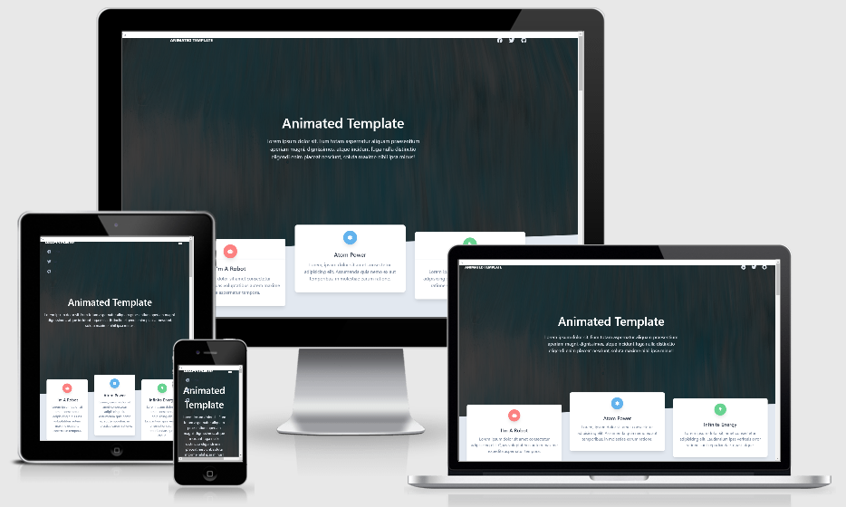

# Animated Template

## Overview
- Animated template using a [Creative Tim Tailwind Starter Kit](https://www.creative-tim.com/learning-lab/tailwind-starter-kit/presentation)

## Technologies

- [Tailwind Starter Kit](https://www.creative-tim.com/learning-lab/tailwind-starter-kit/landing)
- Animation from [AOS | Animate On Scroll Library](https://michalsnik.github.io/aos/)
- Loading 3rd party .js scripts effectively was researched in this [Google article](https://developers.google.com/web/fundamentals/performance/optimizing-content-efficiency/loading-third-party-javascript). Contemplated using `<script async` to download the AOS.js 3rd party library. File size was so small this was considered negligible. 

## Credits

### Content

- Template from [Creative Tim](https://www.creative-tim.com/)
- Icons from [Font Awesome](https://fontawesome.com/)
- Images from [Unsplash | Paweł Czerwiński](https://unsplash.com/@pawel_czerwinski)
- User images from [Random User Generator](https://randomuser.me/)
